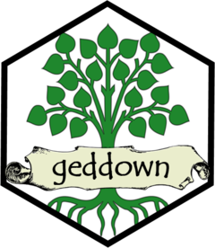

<!-- README.md is generated from README.Rmd. Please edit that file -->

# geddown 

<!-- badges: start -->

<!-- badges: end -->

Produce a variety of RMarkdown-based reports for family tree GEDCOM
files.

Coming (not so) soon\!
